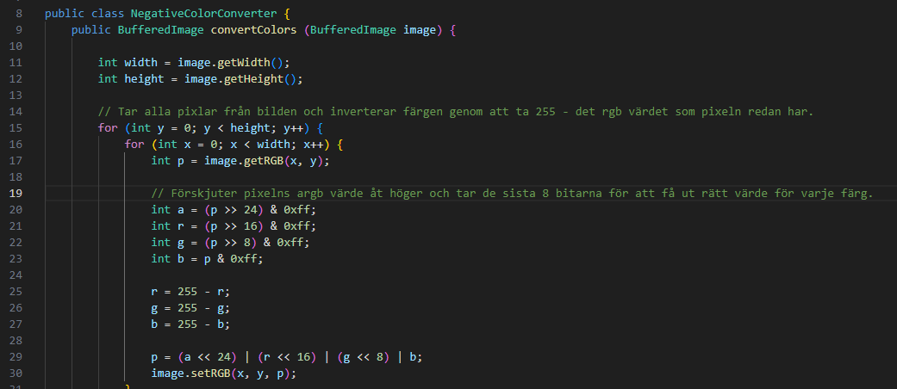
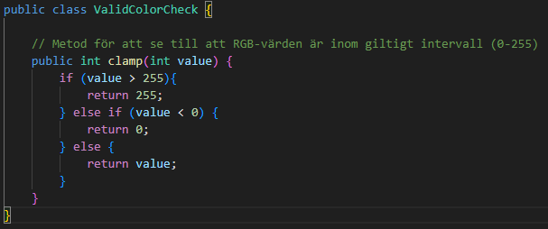
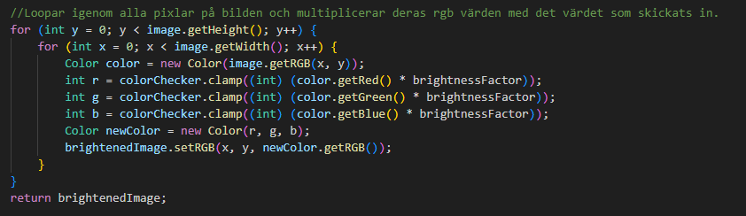
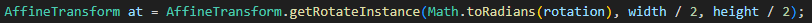

# Reflektion

## Kap 2

Jag tycker att mina variabler och funktioner till mestadels har namn som beskriver vad de är till för. De enda namnet jag inte blev så nöjd med var NegativeColorConverter klassen och dess funktion convertColors, jag tycker det hade varit mer beskrivande att kalla klassen för ColorInverter eller liknande och sedan funktionen invertColors då det är det den gör. Då boken säger "Avoid Disinformation" och convertColors kan ju få en och tro att man kan omvandla färgerna till vad man vill eller annat men så visar det sig att den bara inverterar färgerna. Jag var också lite osäker på variablen a i samma funktion om jag skulle utveckla namnet då det kan finnas personer som inte har hört om alpha som hanterar opaciteten i bilden.

## Kap 3

Mina funktioner tycker jag håller sig till reglerna att ha beskrivande namn och vara små. De flesta gör bara en grej men vissa skulle gått och dela ner i flera funktioner men då jag tycker det hade varit onödigt att göra dem extremt små så gjorde jag inte det. De flesta av mina funktioner är monadics vilket är bra för att hålla funktionerna lätta att läsa, förstå och testa. Jag har även lagt till en ny class bara för att kolla så att färgerna håller sig inom rgb intervallet (0-255) då jag förut hade samma funktion i 2 klasser så gjorde jag så för att hålla min kod "DRY".

## Kap 4

Jag har lagt till några kommentarer som förklarar mer vad som händer i koden och inte bara vad funktionerna gör. Exempelvis kommentaren på bilden som gör det enklare att förstå vad som faktist händer i looparna.

## Kap 5

Min formatering håller sig konsekvent genom alla filer, jag använder mig av 4 spaces indentering och har radbrytningar där jag anser att det behövs för att koden inte ska bli för kluttrig. Filerna har inte mer än 50 raders kod och den längsta raden kod är 113 columner lång vilket är rätt så långt men då det bara är 3 rader som är så långa så tycker jag det fortfarande är lugnt då dem är läsbara.  
De långa raderna:  

## Kap 6

Mina klasser håller sina variabler privata så att data inte kan läckas. I klassen ImageEditor så har jag en variabel image som då är bilden som användaren ska använda och jag använder getters och setters för den så att de som använder modulen inte ska kunna gå in och göra vad dem vill med den. Däremot tycker jag inte att det fanns någon mening med att använda sig av interface i denna modulen då det inte finns mycket information att läckas mer än den som användaren själv lägger in, vilket är bilden i ImageEditor.

## Kap 7

I ImageEditor så har jag throws IOException på både konstruktorn och saveImage funktionen då jag använder ImageIO i dem. En annan fel hantering jag har är min funktion som ser till att om exempelvis användaren multiplicerar bildens färger med för mycket så har jag funktionen på bilden nedan som ser till att rgb värderna inte går utanför rgb intervallet (0-255).  

## Kap 8

I min kod så använder jag inte mycket utomstående kod till variabler eller liknande och jag ser till att inte använda mig av variablerna i flera olika klasser och skickar runt dem. Delen "Eploring and learning boundaries" har jag inte använt mig av när jag skrivit min kod då jag har rätt så lätt för mig att förstå vad koden gör och i just min modul så använder jag mig av ganska lätt "third party" kod som inte är så komplex.

## Kap 9

Mina tester jag har gjort har bra namn på sina variabler och funktionerna beskriver vad dem gör. Jag behövde inte ändra något test med tanke på detta då min kod redan är "Clean". Testerna är dessutom små och lätta att läsa. Jag använder mig inte av en assert per test som boken säger först utan jag använder mig av av ett koncept per test.

## Kap 10

Även om jag inte har många variabler och funktioner i mina klasser är dem organiserade som de ska enligt boken. Mina variabler är inkapslade och storleken på klasserna är små. Sammanhållningen i klasserna är bra då jag har ett litet antal variabler.

## Kap 11

Detta kapitlet har inte påvärkat hur jag har ändrar koden.